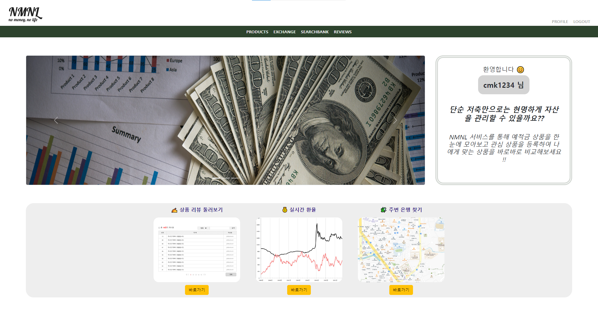
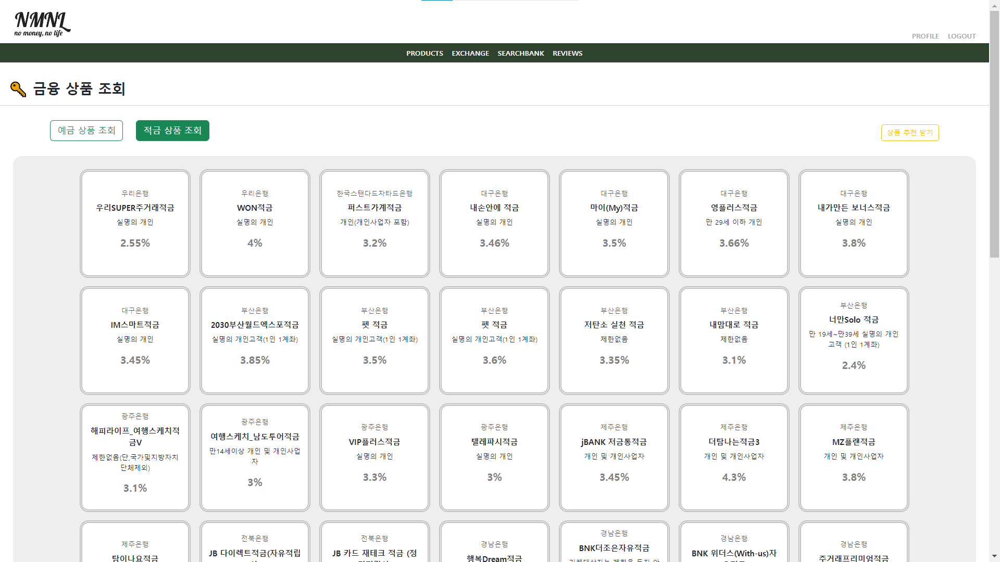
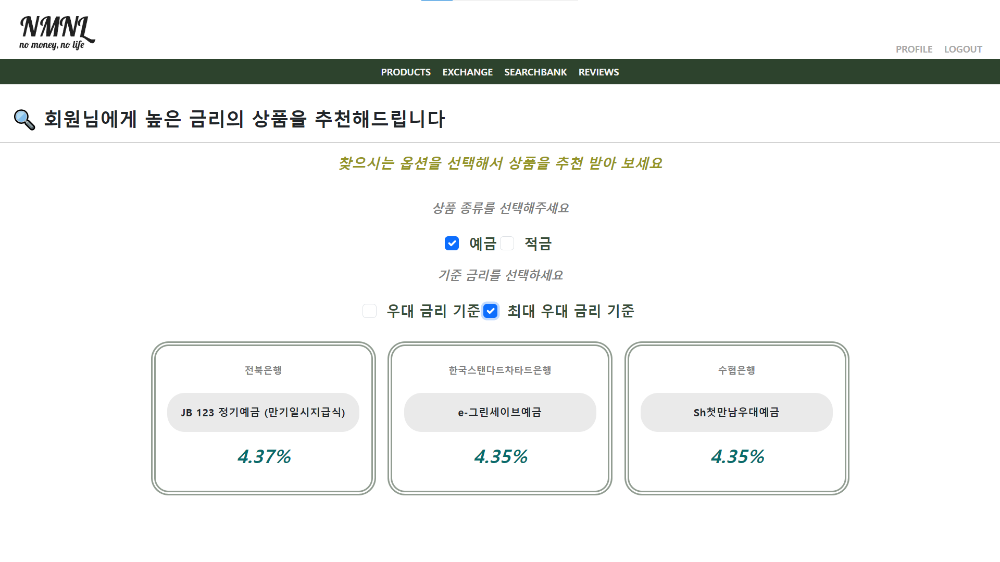
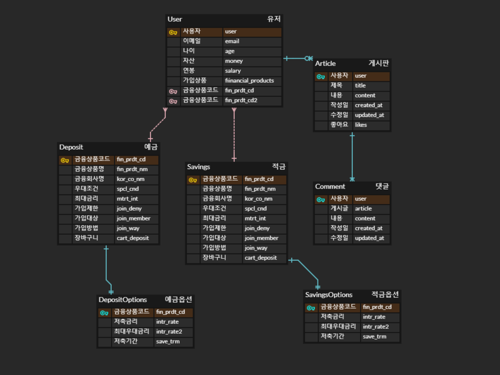

# NMNL

### no money, no life

### 10조 "강민경보다 최민경" 김치욱 최민경

## 💡 개요

- 예적금 금융 상품을 한번에 비교하고, 원하는 옵션을 선택해 적절한 상품을 추천 받는 금융 사이트
- NMNL ( No money, No life )
- 23.11.16 (목) ~ 23.11.24 (금)

## 🔊 서비스소개

- 나에게 맞는 금융 상품을 적절하게 골라 현명하게 자산을 관리하고 싶은 당신에게 !! 은행의 다양한 예적금 상품을 한 눈에 모아 보고 간단한 옵션 선택을 통해 높은 금리의 금융 상품을 추천 받으실 수 있습니다.
- 단순 저축만으로는 현명하게 자산을 관리할 수 있을까요?? NMNL 서비스를 통해 예적금 상품을 한 눈에 모아보고 관심 상품을 등록하여 나에게 맞는 상품을 바로바로 비교해보세요 !!
- 자산은 우리 삶에서 중요한 부분입니다. ( no money no life ) 그렇기에 예적금 상품을 이용하여 더욱 현명하게 자산을 관리해야할 필요가 있음을 전달합니다.

## 🖥 서비스페이지

## 🎨 주요기능소개

- 메인페이지
  - 서비스의 메인 화면으로 서비스 소개와 주요 기능을 바로 이용할 수 있는 바로가기 링크를 포함
  - 예적금 상품 조회, 환율 정보, 근처 은행 찾기, 리뷰 게시판 및 사용자 프로필로 이동할 수 있는 네비게이션 바를 제공
- 예적금 상품 조회
  - 다양한 은행의 예적금 상품 정보와 금리 정보를 카드 형식으로 가독성 좋게 제공
  - 상품 선택 시, 해당 상품의 주요 정보(금리, 가입 대상, 가입 방법 등) 및 상품 옵션 정보를 한 페이지에 제공
- 실시간 환율

  - 원하는 국가를 선택 후 해당 국가의 환율 정보를 바탕으로 매매 기준에 따라 적절한 정보 제공

- 은행 검색

  - 사용자가 원하는 지역 및 원하는 은행의 위치를 바로바로 검색 가능
  - 지역과 은행 옵션은 드롭다운 바로 제공

- 리뷰 게시판

  - 회원 간의 소통과 정보 공유를 위한 공간
  - 가입한 상품 관련 리뷰를 작성하거나 다른 회원과의 금융 관련 정보 공유하기 위한 댓글 및 좋아요 소통 기능 제공

- 회원 관리
  - 예적금 상품 리스트 중 관심이 가는 상품을 좋아요 기능을 이용해 프로필 페이지에서 한 눈에 확인 가능
  - 게시판 리뷰의 좋아요 기능을 추가해 사용자가 좋아요를 누른 게시글을 프로필 페이지에서 모아보기 제공

## 🧩 데이터베이스모델링( ERD )

## 📁 프로젝트분담

- 김치욱 ( 팀장 )

  - 회원가입 및 회원 관리 기능
  - 로그인, 로그아웃 기능
  - 게시글 커뮤니티 기능
  - 좋아요, 댓글 기능

- 최민경 ( 강민경 )
  - 예적금 상품 조회 및 상세 페이지 기능
  - 실시간 환율 정보 기능
  - 근처 은행 찾기 기능
  - 예적금 상품 추천 기능
  - 사이트 디자인 및 CSS

## 👟 프로젝트작업

### 23.11.16 (목)

- 서비스 전체 기획 및 ERD 작성
- 업무 분담 및 페이지 구성
- 컴포넌트 구조 생성
- Django model 구축

프론트 / 백 기준이 아닌 기능별로 업무 분담
사이트 임시 와이어프레임을 그려 전반적인 구성 논의

### 23.11.17 (금)

- 페이지 구성에 필요한 예적금 DB 설계 구축
- 회원 관리 및 시리얼라이즈 구현
- 사이트 페이지 기본 구성

예적금 상품 DB와 옵션 상품을 외래키로 연결하는 과정에서 에러 발생
깃 허브 merge 이슈로 구현이 늦어짐

### 23.11.18 (토)

- 실시간 환율 기능 구현
- 회원 가입 및 회원 수정 구현

회원 유저 기능 구현 시 null 값 처리를 제대로 하지 못해 모델 수정하였음
페어와 적극적 소통을 통해 명확하게 모델을 정의해서 추후 수정을 최소화 해야했으나 세부 사항을 공유하지 않아 문제 발생

### 23.11.19 (일)

- 회원 유저 로그인, 로그아웃 구현 및 유저 정보 프로필 페이지 구성
- 근처 은행 찾기 기능

회원가입 vue 파일이 깃에서 merge가 되지 않는 이슈 발생
근처 은행 찾기 기능 구현 중 깃 푸시 이슈로 코드의 일부 손실
유저 정보 저장 token을 누락하여 에러 발생

### 23.11.20 (월)

- 예적금 상품 조회 기능
- 리뷰 게시판 Django CRUD 구현

예금 상품과 적금 상품을 따로 나열하여 사용자가 원하는 옵션을 선택해서 모아 볼 수 있도록 구현
게시글 좋아요 view 함수를 누락하여 추후 추가하였음

### 23.11.21 (화)

- 예적금 상품 상세 조회 기능
- 상품 장바구니 기능 구현
- 리뷰 게시판 생성, 수정, 삭제 기능

장바구니 기능에서 새로고침 시 값이 초기화 되는 에러 발생
게시판 수정 및 삭제 기능 구현 시 새로고침을 해야만 업데이트 되는 에러 발생

### 23.11.22 (수)

- 리뷰 게시판 좋아요, 댓글 기능
- 금융 상품 추천 기능

게시글 및 댓글이 하나 남았을 때, 삭제가 되지 않는 이슈 발생
금융 상품 추천의 경우 사용자가 원하는 옵션을 선택했을 때 기준으로 높은 금리의 상품 3가지를 추천해주기로 결정

### 23.11.23 (목)

- 메인페이지 구성
- 사용자 프로필 페이지 구현
- 회원 관리 기능 일부 수정

사용자의 회원 정보 수정 시 프로필 페이지에 업데이트 되지 않는 에러 발생

## 🎤 프로젝트 소감

#### 김치욱 ( 팀장 )

- 짧은 시간이지만 눈에 보이는 결과물을 만들 수 있었다는 것이 신기했습니다. 배운 내용들을 토대로 프로젝트에 내용들을 하나씩 추가하며 페이지가 생기는 것들을 보니 앞으로 어떻게 내가 개발을 하겠냐는 두려움이 사라졌습니다. 
- 다만 아쉬운 점이 몇가지 있었습니다. 좋아요 기능을 만들 때 게시글 좋아요는 교재를 참고하며 만들 수 있었지만, 상품 좋아요 기능 같은 경우에는 로컬 데이터를 통해서 데이터를 만들어 이용하고싶었습니다. 몇 일 몇 시간을 투자했지만 구현해내는데 실패하여 아쉬운 마음이 듭니다.
- 다른 프로젝트 들을 개인적으로 진행해서 앞으로 진행할 프로젝트들을 잘 할 수 있도록 준비해야겠습니다. 

#### 최민경

첫 프로젝트라 부담도 흥미도 있었지만, 그 만큼 구성에서 부족한 부분도 많았고 처음 시작 시 탄탄한 기본 구성을 제대로 갖추고 시작해야한다는 것을 배웠습니다. 기존에 몇 달간 학습한 내용을 일주일이라는 짧은 시간만에 구현해 낸다는 것이 많이 어려웠고, 그만큼 많은 에러와 이슈를 경험하며 배운 점과 경험이 쌓였습니다. 에러 발생 시 그 에어를 해결하기 위해 몇시간 동안 내가 구현한 코드를 다시 공부하고 여러가지 방법으로 해결 방안을 구현해 보면서 실제로 하나의 서비스를 구성하기 위해 많은 노력이 들어감을 배웠고 성장할 수 있었습니다. 다음 프로젝트 때는 시간이 조금 걸리더라도 기본 구성을 탄탄히 하여 추후 수정을 최소화 하기 위해 노력헤보겠습니다.